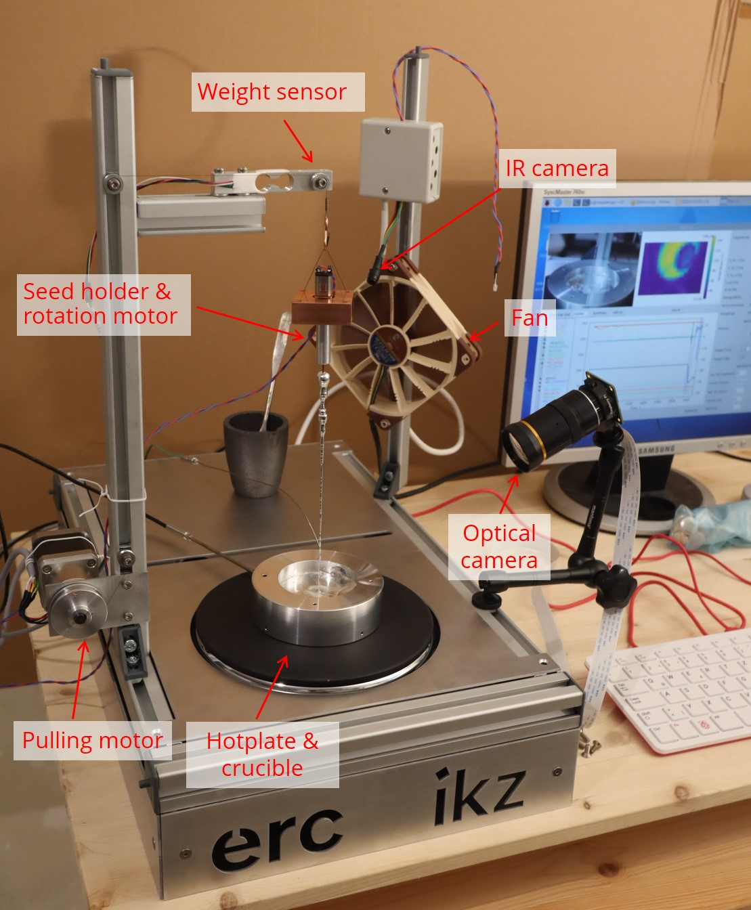
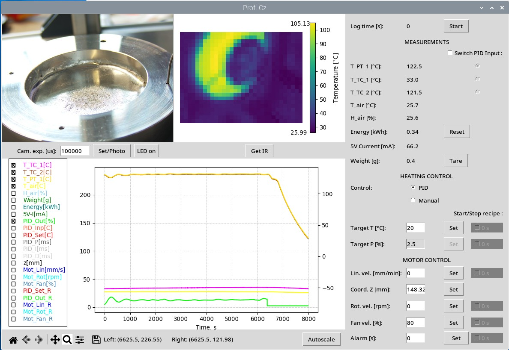

# educrys-control-basic

This repository provides basic control scripts in Python for the EduCrys setup. A new version with a modular, object-oriented Python code is being developed [here](https://github.com/poc-handsome/educrys-control-modular), but has not been finished yet.

## Setup

The EduCrys setup is shown in the photo below. See [educrys-hardware](https://github.com/poc-handsome/educrys-hardware) for a further description of the hardware.
Description of experiments is provided in [educrys-experiments](https://github.com/poc-handsome/educrys-experiments).



## Control software

The software can be started by running the "RunExperiment.sh" script on the Raspberry Pi desktop. Alternatively, the following manual steps can be executed in a command-line Terminal:
- Start the python environment in the "Documents" folder: ```source venv_2/bin/activate```
- Make a new folder containing all files from [software](https://github.com/poc-handsome/educrys-control-basic/tree/main/software)
- Change to this folder in the terminal and run ```python3 democz_game.py```

A screenshot of the control software GUI is shown below.



**NOTE: once the GUI is running, the components of EduCrys are being controlled by the GUI elements until the window is closed.**
On closing, heating and all motors are stopped as indicated in the command line output.

The key elements of the GUI are described in the sections below.

### Logging

The **Start/Stop** button on the top right activates data logging: 
- Camera and infrared images are stored in image files with a timestamp in the file name. Default sample rate is 30 s.
- All sensor and process parameters are written to a text file. A new file with a timestamp in the file name on each program run. Default sample rate is 2 s.
- Values are added to the plot

### Images

Image from Raspberry Pi camera is taken (and stored) when **Set/Photo** is pressed or at a specified sample rate during logging. The camera should be adjusted before running GUI, for example with the command ```libcamera-still -t 0```.
  
Image from the infrared sensor is taken (and stored) when **Get IR** is pressed or at a specified sample rate during logging. Note that only surfaces with emissivity near 1.0 show accurate temperatures. For example, the hot plate surface is fine, but the metallic crucible looks much colder than it is in reality.

Both images shown in the GUI are NOT live images.

### Plot

The plot shows sensor values and process parameters, where individual curves can be disabled with checkboxes. Data in the plot is only updated if logging is active. Note that ranges of axes are usually not updated automatically (to keep the GUI responsive). Therefore, pressing **Autoscale** or zooming out may be needed.

### Measurements

Temperature sensors:
- **T_PT_1**: Pt100 resistance sensor with 3 mm thickness used for crucible temperature
- **T_TC_1**: Type K thermocouple with 1 mm thickness used for crucible or melt temperature
- **T_TC_2**: another Type K thermocouple
- **T_air and H_air**: air temperature and humidity in the small sensor box

**Energy** denotes power consumption of the 230V heating plate, which is calculated from nominal power and active time. Energy usage counter can be set to zero with "Reset".

**5V Current** denotes current consumption on the Raspberry Pi 5V line, which is used for motors, LED and several sensors. This should usually not exceed a few 100 mA.

**Weight** comes from the weight cell attached to the seed holder. Press **Tare** after attaching the seed to obtain the weight of the growing crystal. Note the maximum weight of 1 kg.

### Heating control

The 1500W hotplate inside the setup is controlled by an Solid State Relay, which is periodically switched on/off. Two modes are available:
- In the **PID** mode the temperature of the chosen sensor **PID Input** is controlled to reach **Target T**
- In the **Manual** mode the power **Target P** is set to a given value in %. The percentage means the active time in a 10 sec on/off cycle. E.g. 5% = 0.5 sec on and 9.5 sec off. The following power limits are active in both (!) PID and Manual modes:
  - 2.5% or lower: hotplate remains off
  - 50% = maximum power. This power may still produce temperatures over 300 °C on the hotplate!

### Motor control

The following motor speeds can be set. Typical limits are specified below. The values are only applied once **Set** is pressed.
- **Lin. vel.**: pulling wire (linear motion), -100...100 mm/min
- **Rot. vel.**: seed rotation, -12...12 rpm. Note that the motors needs a value of about 3 rpm to start moving.
- **Fan. vel.**: cooling fan, 0...80%. 

**Coord. Z** denotes the vertical (Z) coordinate of the seed holder. The default range is 0...220 mm, and the motor is automatically stopped when reaching these limits. The programm always starts with a default value Z=100 mm! Measure the real position and use **Set** to adjust it in the GUI.

### Recipes

The checkboxes **Start/stop recipe** initiate reading the time recipes from "recipes.txt" if enabled. This is possibly only when data logging is already running! During an active recipe, the manual parameter input is disabled.

A recipe is defined by two lists in the format:
```
sptime = [ 0,   1800,  2400, 7200 ] # time in sec
spvalu = [ 60,  220,   237,  237  ] # temperature in C
```
The first list contains the time instants and the second list contains the controlled paramter (temperature, heating power, pulling speed, rotations speed, fand speed). If the file contains several lists with the same keyword, only the last is applied. When a recipe is started, check the command line output and activate the curve in the plot.

While the temperature and power are interpolated linearly between the data points, the motor speeds are switched without interpolation (this could be changed in the Python code if needed).

### Settings

The first section of the main Python script defines all programm settings. 

These True/False switches can disable specific components, if the programm cannot be started due to hardware errors:
- ENABLE_WEI: Weight sensor
- ENABLE_CAM: Camera
- ENABLE_GPAD: Gamepad. A known problem is changed port (default: /dev/input/event7) in the gamepad.py file.
- ENABLE_IR: Infrared sensor. If this sensor is disabled, a camera image file can be loaded and shown in the GUI.
- ENABLE_SHT: Air temperature and humidity sensor. A hardware error will occur, if the cable to the small sensor box is not attached correctly.
- ENABLE_INA: 5V current measurement
- ENABLE_VIFCON: Serial RS232 interface for remote control. 

The most important sample times are:
- SENSOR_SAMPLETIME (default 2 s): Sensor readout, GUI refresh, data logging in text file
- CAMERA_SAMPLETIME (default 30 s): Camera and infrared sensor pictures shown in GUI and stored in files

Other settings are related to the limits mentioned above and various hardware configurations. **You should only change these if you know what you are doing, because the setup could be damaged.**

## Acknowledgements

[This project](https://poc-handsome.github.io/) has received funding from the European Research Council (ERC) under the 
European Union’s Horizon Europe framework programme for research and innovation (grant agreement No. 101122970).


